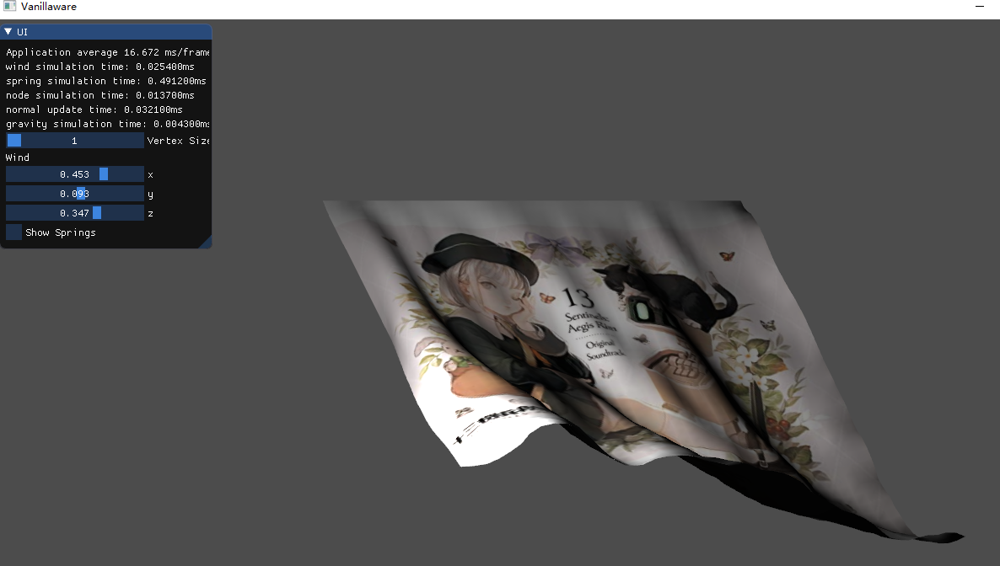
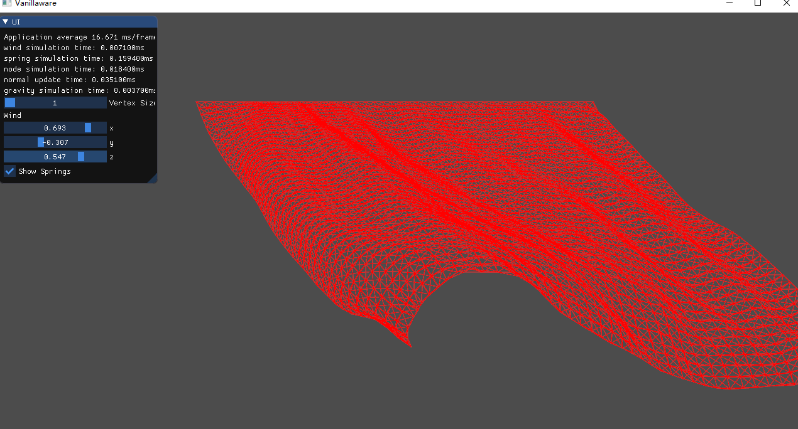

# Cloth_Simulation

## Mass Spring Damper System
2304 mass nodes, 13346 springs
Each node attaches 3 different kinds of springs:
1. structural spring
2. shear spring
3. bending spring

Each spring simulates spring force(Hooke's law) and damping.

Verlet integration is used for numerical integration.

Simulates gravity and wind.

### Things can be done to make this project better:
1. GPGPU simulation
2. Tessellation for surface subdivision(maybe?)
3. Cloth-Cloth collision
4. Cloth-other obj collision
5. Max stretch
6. Quilting(marching cube)
